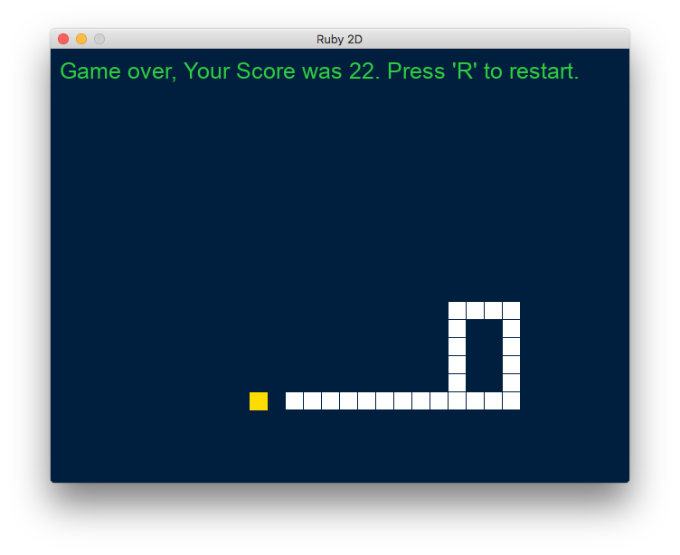
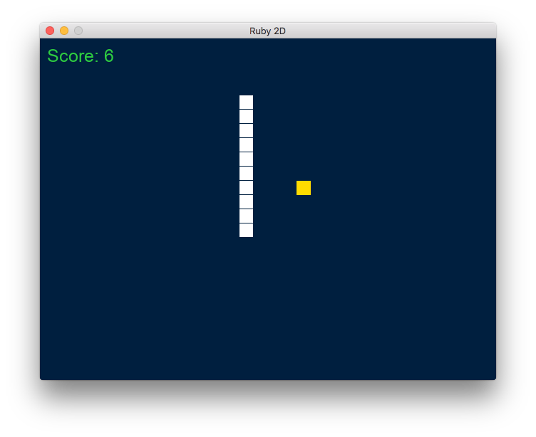

# SnakeGame
Snake Game - In 1996, Next Generation ranked it number 41 on their "Top 100 Games of All Time"

The Snake design dates back to the arcade game Blockade,developed and published by Gremlin in 1976. It was cloned as Bigfoot Bonkers the same year. In 1977, Atari, Inc. released two Blockade-inspired titles: the arcade game Dominos and Atari VCS game Surround. Surround was one of the nine Atari VCS launch titles in the US and was sold by Sears under the name Chase. That same year, a similar game was launched for the Bally Astrocade as Checkmate.

The first known home computer version, titled Worm, was programmed in 1978 by Peter Trefonas for the TRS-80, and published by CLOAD magazine in the same year. This was followed shortly afterwards with versions from the same author for the Commodore PET and Apple II. A clone of the Hustle arcade game, itself a clone of Blockade, was written by Peter Trefonas in 1979 and published by CLOAD. An authorized version of Hustle was published by Milton Bradley for the TI-99/4A in 1980. The single-player Snake Byte was published in 1982 for Atari 8-bit computers, Apple II, and VIC-20; a snake eats apples to complete a level, growing longer in the process. In Snake for the BBC Micro (1982), by Dave Bresnen, the snake is controlled using the left and right arrow keys relative to the direction it is heading in. The snake increases in speed as it gets longer, and there's only one life.

Nibbler (1982) is a single-player arcade game where the snake fits tightly into a maze, and the gameplay is faster than most snake designs. Another single-player version is part of the 1982 Tron arcade game, themed with light cycles. It reinvigorated the snake concept, and many subsequent games borrowed the light cycle theme.

Starting in 1991, Nibbles was included with MS-DOS for a period of time as a QBasic sample program. In 1992, Rattler Race was released as part of the second Microsoft Entertainment Pack. It adds enemy snakes to the familiar apple-eating gameplay. 

<table width:100%>
  <tr>
    <td></td>
    <td></td>
  </tr>
</table>

# Install the gem ruby2d

    $sudo apt-get update

    $sudo apt-get install libsdl2-dev libsdl2-image-dev libsdl2-mixer-dev libsdl2-ttf-dev

    $gem install ruby2d

# Run the game

    $ruby snake
